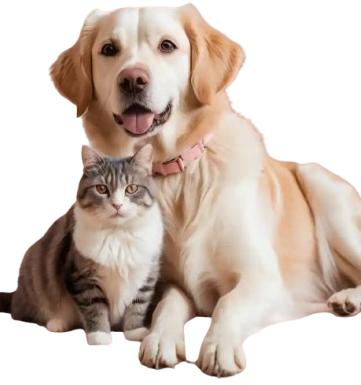

# 🐾 Pet&Style – Loja de Estilo para Pets

Bem-vindo ao **Pet&Style**, um site fictício de e-commerce focado em produtos estilosos, confortáveis e de alta qualidade para cães e gatos. O projeto foi desenvolvido com **HTML** e **Tailwind CSS**, totalmente responsivo e com foco em usabilidade e design limpo.



---

## 📌 Funcionalidades

- ✅ Navegação responsiva com menu fixo
- ✅ Sessão de produtos com grade flexível
- ✅ Depoimentos de clientes com design atrativo
- ✅ Formulário de contato funcional (estático)
- ✅ Estilização moderna com Tailwind CSS

---

## 🚀 Tecnologias utilizadas

- **HTML5**
- **Tailwind CSS**
- **Responsividade Mobile-first**
- **Imagens otimizadas**

---

## 📂 Estrutura de pastas

```bash
pet-style/
│
├── src/
│   ├── assets/            # Imagens e ícones do site
│   └── styleOutput.css    # Arquivo CSS final gerado pelo Tailwind
│
├── index.html             # Página principal
├── tailwind.config.js     # Configuração do Tailwind (se aplicável)
├── postcss.config.js      # (se aplicável para build com Tailwind)
└── README.md              # Este arquivo
```
